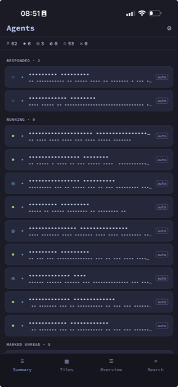

# TMUX Agent Dashboard

A phone companion for a fleet of coding agents running in tmux. It tells you the moment
an agent needs you, and lets you read its conversation, approve a permission prompt, or
reply - without opening tmux.

It mirrors the [tmux-agent-dashboard](https://github.com/kaiiserni/tmux-agent-dashboard) TUI: the same
attention/running/idle classification, tiles, and per-project overview. It adds a
per-pane detail screen the TUI doesn't have — the transcript as a chat, the live
screen, and the activity log split into tabs. From there you reply in free text or
by voice, answer a permission prompt, or send raw keys (insert, paste, interrupt).
When an agent newly needs you, the app fires a local notification, a haptic tap, and
a short sound you can switch off.

Everything stays on your own network. The app talks to a small self-hosted HTTP
bridge over LAN/WireGuard; no agent data leaves your machines.

<p align="center">
  
</p>

## Architecture

```
 iPhone (Expo app) ──HTTP over LAN/WireGuard──▶ agent-bridge (Bun) ──▶ tmux
                                                     │
                                                     └─ reads @pane_* options,
                                                        activity logs, Claude Code
                                                        session transcripts
```

- **`server/`** - the agent-bridge: a small Bun HTTP server that reads live tmux
  pane state and serves it to the app, and turns app requests into `tmux` commands
  (mark seen, clear, jump, reply, answer a prompt). Runs on the machine hosting tmux.
- **App** (repo root, Expo/React Native) - four tabs (Summary / Tiles / Overview /
  Search) + a pane detail screen with the agent conversation, live screen, activity,
  a full interactive terminal (xterm.js over a PTY), a reply bar, and keystroke controls.

## Requirements

- A Mac/Linux box running your agents in tmux, with the
  [tmux-agent-dashboard](https://github.com/kaiiserni/tmux-agent-dashboard) hooks installed (they stamp the
  `@pane_*` options the bridge reads).
- [Bun](https://bun.sh) on that box (for the bridge).
- An iPhone on the same LAN or WireGuard network, with [Expo Go](https://expo.dev/go)
  (or an EAS dev build).

## Setup

### 1. Bridge

```sh
cd server
bun install
# generate a bearer token (protects every data + action route)
mkdir -p ~/.config/agent-bridge
head -c 24 /dev/urandom | base64 | tr -d '/+=' | head -c 32 > ~/.config/agent-bridge/token
chmod 600 ~/.config/agent-bridge/token
bun run bridge.ts
```

The bridge listens on `0.0.0.0:8790`. Keep it reachable only over your LAN/WireGuard.
To run it as a service, adapt `server/agent-bridge.plist.example` (macOS launchd).

### 2. App

```sh
bun install
bun start          # Expo dev server; open in Expo Go
```

In the app's **Settings**, set the bridge URL (e.g. `http://192.168.1.10:8790`)
and paste the token from `~/.config/agent-bridge/token`.

## Security model

- Every route except `/health` requires the bearer token - the read endpoints
  carry agent data, so LAN reachability alone must not grant access.
- The reply/answer endpoints inject keystrokes into live agents, so they are
  gated to `claude` panes, re-verify a choice menu before sending, and every
  mutation is written to an append-only audit log
  (`~/.config/agent-bridge` state dir).
- Bind the bridge to a trusted interface only. There is no built-in TLS; run it
  behind WireGuard/LAN, not on a public interface.

## Roadmap

- Silent push wake (self-hosted APNs) so alerts arrive with the app closed.
- Home-screen widget / Live Activity for the top pending agent.
- Optional smart-glasses HUD for glanceable alerts.

## Related

- [tmux-agent-dashboard](https://github.com/kaiiserni/tmux-agent-dashboard) - the tmux
  TUI this app mirrors, and the source of the `@pane_*` hooks the bridge reads.

## License

MIT - see [LICENSE](./LICENSE).
